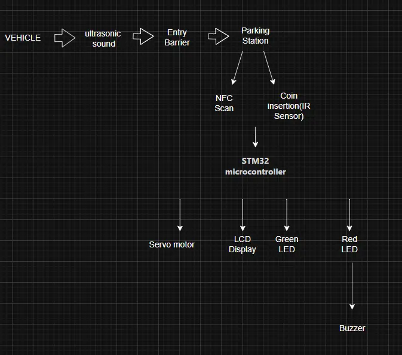

# Smart Dual-Barrier Parking System with NFC and Coin Detection

A smart parking barrier system designed to simulate a realistic automated parking management 

::info 
**Author**: Mira Mehdi Bark \
**Group**: 1221ED \
**GitHub Project Link**: https://github.com/UPB-PMRust-Students/project-2026-mira.mehdi

:::

## Description

This project demonstrates a smart parking barrier system built using the STM32 NUCLEO-U545RE microcontroller. When a vehicle arrives at the entrance, an ultrasonic sensor detects it and opens the entry barrier while registering the vehicle as unpaid.Moreover, at the payment station the driver must scan an NFC tag and insert a coin that is detected by an IR sensor to confirm payment, after which the system updates the vehicle status. At the exit barrier, the NFC tag is scanned again and the system verifies payment if the payment is confirmed, the barrier opens with a green LED and confirmation message on the LCD shows, otherwise the barrier stays closed and a red LED appears, buzzer alerts, and payment is denied.

## Motivation

The motivation of this project is to show how a real life parking control works to improve efficiency, security, and automation in everyday services.Also, It provides practical experience in working with hardware components, system integration, and verification logic, making it a valuable learning platform for modern intelligent transportation and smart city applications.

## Architecture

This system is built using **STM32 NUCLEO-U545RE-Q** which coordinates all functions:

* **Vehicle Detection Module:** Detects the arrival of a car at the entry gate and sends a signal to the control unit to open the entry barrier that the car is registered as **NOT PAID**.
* **Payment Processing Module:** Manages NFC identification and coin confirmation together before sending payment data to the controller and verifies the two payment methods to change the status in the system as **PAID**.
* **Exit Verification Module:** Checks the vehicle’s payment status using the second NFC scan at the exit gate and if the payment is confirmed or denied.
* **User Notification Module:** Displays messages and activates visual and audio alerts depending on payment status.

## Log

## Week 2
* Worked on the word documentation to be able to implement the idea of the project.

## Week 4 - 5
* Ordered the hardware components for the project

## Week 7
* Started to work on components testing

## Hardware

The system is built around the STM32 NUCLEO-U545RE microcontroller, which acts as the main controller responsible for processing data and coordinating all modules. Two NFC readers are used to scan the vehicle’s NFC tag at the payment and exit stations for verification. Two SG90 servo motors control the opening and closing of the entry and exit barriers, while a LCD display shows system messages such as payment status. A green LED indicates successful payment and access approval, whereas a red LED with a buzzer signals payment denied. An ultrasonic sensor detects vehicle presence at the entrance to open the berrier, and an IR sensor detects coin insertion at the payment station. However, all the coennections are on the breadboard and using jumper wires.

## Schematics

Place your KiCAD or similar schematics here in SVG format.

## Bill of Materials

| Device | Usage | Price |
| :--- | :--- | :--- |
| STM32 NUCLEO-U545RE-Q | The main microcontroller | ~125 RON |
| Set of two NFC Reader | Card/User authentication | ~84 RON |
| Servo Motor | Barrier Movement | ~56 RON |
| LCD | Display Status Message | ~24 RON |
| LED Kit | Access indicator | ~25 RON |
| Buzzer | Warning sound output | ~19 RON |
| Jumper Wires | Components connections | ~10 RON |
| Ultrasonic distance sensor  | Sensor detection | ~37 RON |
| Breadboard | Circuit Prototyping | ~10 RON |
| IR sensor | Coin detection | ~19 RON |

## Software

| Library | Description | Usage |
| :--- | :--- | :--- |

## Links

